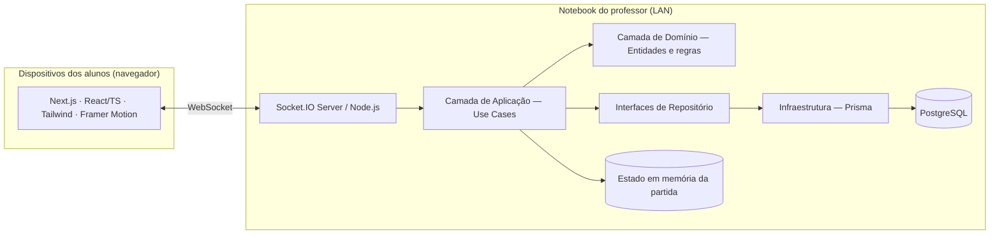
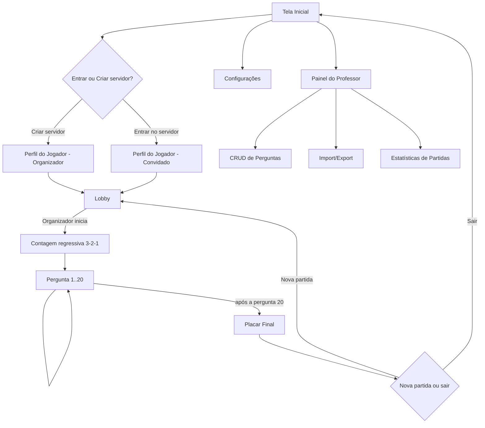

# Arquitetura Técnica — Gincana Educativa Multiplayer (LAN)

> Documento de planejamento (etapas 1 a 7 do seu escopo). Nenhuma linha de código de aplicação foi escrita ainda — é para você revisar e aprovar antes de eu partir para a implementação.

---

## 1. Arquitetura Completa do Sistema

**Topologia para sala de aula:** o computador do professor roda o backend (Node.js + Socket.IO) e o PostgreSQL (via Docker), e serve o frontend Next.js. Os alunos só precisam de um navegador e conexão ao Wi-Fi local — acessam pelo IP local do professor ou por QR Code gerado na tela inicial. Não depende de internet.

**Camadas (Clean Architecture):**



- **Domínio:** entidades puras (Pergunta, Partida, JogadorPartida, Equipe) e regras de pontuação/balanceamento, sem depender de framework nenhum.
- **Aplicação:** use cases de responsabilidade única — `CriarSalaUseCase`, `IniciarPartidaUseCase`, `SubmeterRespostaUseCase`, `CalcularPontuacaoUseCase`, `FinalizarPartidaUseCase`, `GerenciarPerguntasUseCase`.
- **Infraestrutura:** implementações Prisma dos repositórios + um `MatchStateManager` em memória (um `Map` por `codigoSala`) que guarda timer, pergunta atual e placar ao vivo — isso evita bater no banco a cada segundo e mantém a latência baixa. O banco só é gravado em checkpoints (início da partida, cada resposta, fim da partida), garantindo que as estatísticas fiquem salvas para o professor mesmo com o jogo sendo majoritariamente em memória.
- **Apresentação:** páginas/componentes Next.js, sempre consumindo os use cases via eventos de socket — nunca acessando Prisma diretamente.

**SOLID na prática:** cada use case faz uma coisa só (SRP); repositórios são interfaces que a infraestrutura implementa (DIP) — isso já deixa pronta a porta para a futura `IAQuestionGenerator` implementar a mesma interface `PerguntaRepository` sem tocar em domínio ou use cases; a seleção de perguntas por idade/dificuldade é uma estratégia isolada e substituível (OCP).

**Perfis temporários:** o requisito de que os dados do jogador existam só durante a sessão é respeitado — o perfil vive no socket/estado em memória; só quando a partida realmente começa é criado um snapshot `JogadorPartida` no banco (para estatísticas do professor), sem virar uma conta permanente.

---

## 2. Fluxograma das Telas



Tempo de aula (45 min): Lobby ≈5 min → 20 perguntas ≈35 min (perguntas de 15-20s + explicação) → Placar final ≈5 min.

---

## 3. Modelagem do Banco de Dados (Prisma)

```prisma
enum Categoria {
  HISTORIA
  PORTUGUES
  GRAMATICA
  RACIOCINIO_LOGICO
}

enum Dificuldade {
  FACIL
  MEDIA
  DIFICIL
}

enum Equipe {
  AZUL
  VERMELHO
}

enum StatusPartida {
  LOBBY
  EM_ANDAMENTO
  FINALIZADA
}

model Pergunta {
  id              String      @id @default(cuid())
  enunciado       String
  alternativas    Json        // array de 4 strings
  respostaCorreta Int         // índice 0-3
  explicacao      String
  categoria       Categoria
  dificuldade     Dificuldade
  idade           Int         // 6 a 11
  ativo           Boolean     @default(true)
  criadoEm        DateTime    @default(now())

  perguntasPartida PerguntaPartida[]
  respostas        RespostaPartida[]

  @@index([categoria, dificuldade, idade])
}

model Partida {
  id            String        @id @default(cuid())
  codigoSala    String        @unique
  status        StatusPartida @default(LOBBY)
  organizadorId String
  iniciadaEm    DateTime?
  finalizadaEm  DateTime?
  criadaEm      DateTime      @default(now())

  jogadores     JogadorPartida[]
  perguntas     PerguntaPartida[]
  respostas     RespostaPartida[]
}

model JogadorPartida {
  id             String  @id @default(cuid())
  partidaId      String
  nomeSessao     String
  idade          Int
  avatar         String
  corFavorita    String
  equipe         Equipe
  pontuacao      Int     @default(0)
  acertos        Int     @default(0)
  maiorSequencia Int     @default(0)

  partida        Partida @relation(fields: [partidaId], references: [id])
  respostas      RespostaPartida[]
}

model PerguntaPartida {
  id         String   @id @default(cuid())
  partidaId  String
  perguntaId String
  ordem      Int

  partida    Partida  @relation(fields: [partidaId], references: [id])
  pergunta   Pergunta @relation(fields: [perguntaId], references: [id])

  @@unique([partidaId, ordem])
}

model RespostaPartida {
  id                   String   @id @default(cuid())
  partidaId            String
  jogadorId            String
  perguntaId           String
  alternativaEscolhida Int?
  correta              Boolean
  tempoRespostaMs      Int
  pontosGanhos         Int
  respondidaEm         DateTime @default(now())

  partida  Partida        @relation(fields: [partidaId], references: [id])
  jogador  JogadorPartida @relation(fields: [jogadorId], references: [id])
  pergunta Pergunta       @relation(fields: [perguntaId], references: [id])
}
```

`Pergunta` é o banco reutilizável entre partidas; `Partida`/`JogadorPartida`/`RespostaPartida` existem por sessão de jogo e alimentam o painel de estatísticas do professor.

---

## 4. Estrutura dos Eventos Socket.IO

**Cliente → Servidor**

| Evento | Payload | Descrição |
|---|---|---|
| `sala:criar` | `{ nomeSessao, idade, avatar, corFavorita }` | Cria sala, vira organizador |
| `sala:entrar` | `{ codigoSala, nomeSessao, idade, avatar, corFavorita }` | Entra em sala existente |
| `jogador:escolherEquipe` | `{ equipe }` | Azul ou Vermelho |
| `jogador:pronto` | `{ pronto }` | Marca status pronto/não pronto |
| `organizador:iniciarPartida` | — | Só o organizador pode disparar |
| `partida:responder` | `{ perguntaId, alternativaEscolhida, tempoRespostaMs }` | Envia resposta da pergunta atual |
| `professor:criarPergunta` / `editarPergunta` / `excluirPergunta` | dados da pergunta | CRUD do banco de perguntas |
| `professor:importarPerguntas` / `exportarPerguntas` | JSON | Import/export em lote |

**Servidor → Cliente**

| Evento | Payload | Descrição |
|---|---|---|
| `sala:atualizada` | lista de jogadores, equipes, status | Atualiza lobby em tempo real |
| `sala:erro` | `{ mensagem }` | Código inválido, sala cheia, etc. |
| `partida:iniciada` | `{ contagem }` | Dispara contagem 3-2-1 |
| `pergunta:nova` | `{ numero, enunciado, alternativas, categoria, dificuldade, tempoLimite }` | Nova pergunta para todos |
| `pergunta:tempoEsgotado` | `{ respostaCorreta, explicacao }` | Revela gabarito e explicação |
| `placar:atualizado` | pontuação por equipe + ranking | Sincroniza placar ao vivo |
| `partida:finalizada` | ranking completo + destaques | Tela de resultado final |
| `professor:perguntasAtualizadas` | lista de perguntas | Atualiza painel do professor |

---

## 5. Wireframes (baixa fidelidade)

```
TELA INICIAL                    PERFIL DO JOGADOR
┌───────────────────────┐       ┌───────────────────────┐
│      [Logo/Título]    │       │  Nome: [_________]    │
│  [ Entrar no servidor ]│       │  Idade: [6][7][8]...  │
│  [ Criar servidor    ] │       │  Avatar: 🤖🧑‍🚀🏴‍☠️🧙 ...  │
│  [ Configurações     ] │       │  Cor favorita: ⬤⬤⬤⬤  │
│  [ Créditos          ] │       │      [ Confirmar ]    │
└───────────────────────┘       └───────────────────────┘

LOBBY                                    PERGUNTA
┌─────────────────────────────┐  ┌─────────────────────────────┐
│ Sala: ABC123      [Iniciar] │  │ ▓▓▓▓▓▓▓░░░  Tempo: 12s      │
│ 🔵 EQUIPE AZUL │🔴 EQUIPE VERM│  │ Pergunta 7/20 · Gramática   │
│ • João (7) ✅  │• Ana (8) ✅  │  │ Placar: 🔵450  🔴380        │
│ • Léo  (6) ⏳  │• Rui (7) ✅  │  │                             │
│ [Trocar equipe]│              │  │ "Qual é o plural de...?"    │
└─────────────────────────────┘  │  [A] [B] [C] [D]            │
                                  └─────────────────────────────┘

PLACAR FINAL                       PAINEL DO PROFESSOR
┌───────────────────────┐         ┌───────────────────────────┐
│   🏆 EQUIPE VERMELHA   │         │ [+ Nova pergunta]          │
│  🔵 450   🔴 620       │         │ Filtros: Idade▾ Matéria▾   │
│  Melhor jogador: Ana   │         │ Dif.▾  [Importar][Exportar]│
│  Mais rápido: Rui      │         │ ─ Lista de perguntas ─     │
│  Maior sequência: João │         │ [Editar][Excluir] por item │
│  [Nova partida][Sair]  │         │ Estatísticas de partidas   │
└───────────────────────┘         └───────────────────────────┘
```

---

## 6. Organização das Pastas

```
gincana-educativa/
├── prisma/
│   ├── schema.prisma
│   └── seed.ts                     # banco inicial de perguntas
├── server/
│   ├── index.ts                    # servidor Node + Socket.IO
│   ├── socket/
│   │   └── handlers/               # sala, partida, professor
│   ├── domain/
│   │   ├── entities/
│   │   ├── repositories/           # interfaces (DIP)
│   │   └── use-cases/
│   └── infrastructure/
│       ├── repositories/           # implementações Prisma
│       └── match-state/            # MatchStateManager em memória
├── src/
│   ├── app/
│   │   ├── page.tsx                # Tela inicial
│   │   ├── perfil/page.tsx
│   │   ├── lobby/[codigoSala]/page.tsx
│   │   ├── partida/[codigoSala]/page.tsx
│   │   ├── resultado/[codigoSala]/page.tsx
│   │   └── admin/
│   │       ├── page.tsx
│   │       └── perguntas/page.tsx
│   ├── components/
│   │   ├── ui/                     # design system
│   │   ├── lobby/
│   │   ├── quiz/
│   │   └── admin/
│   ├── hooks/useSocket.ts
│   └── lib/socket-client.ts
├── types/shared.ts                 # tipos compartilhados client/server
├── data/questions-seed.json
├── docker-compose.yml              # PostgreSQL local
├── .env.example
└── package.json
```

---

## 7. Plano de Desenvolvimento por Etapas

| Fase | Entregável |
|---|---|
| 0 | Setup: Next.js + TS + Tailwind + Prisma + Docker Compose (Postgres) |
| 1 | Domínio + schema + seed do banco de perguntas (6 idades × 3 dificuldades × 4 matérias) |
| 2 | Tela inicial + perfil do jogador (sem tempo real ainda) |
| 3 | Socket.IO: lobby em tempo real (entrar/sair, equipes, pronto, balanceamento) |
| 4 | Loop da partida: seleção de 20 perguntas, timer, respostas, pontuação ao vivo |
| 5 | Placar (ao vivo e final), animações Framer Motion, destaques |
| 6 | Painel do professor: CRUD, filtros, import/export, estatísticas |
| 7 | Responsividade (celular/tablet/notebook/TV), acessibilidade, polimento visual |
| 8 | Guia de uso em sala (como subir o servidor local, gerar QR Code de acesso) e README |

---

## Próximos passos

Conforme seu pedido, ainda não implementei nada — isso é só o plano. Antes de eu começar a codar, me diga:

1. O nome de sala Socket.IO / servidor (customizado dentro do Next.js) ou servidor Node separado (Express + Socket.IO) — recomendo a segunda opção, mais alinhada com Clean Architecture.
2. Se você já tem um banco de perguntas pronto (Word/Excel) ou se eu crio um seed inicial de exemplo por idade/matéria.
3. Se posso seguir a ordem de fases acima ou prefere priorizar algo (ex: painel do professor primeiro).

Quando aprovar, começo pela Fase 0 e vou entregando por etapas.
